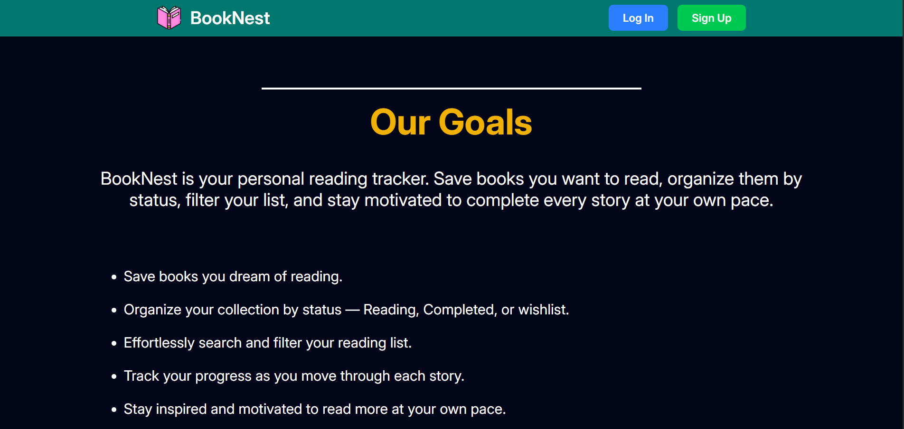
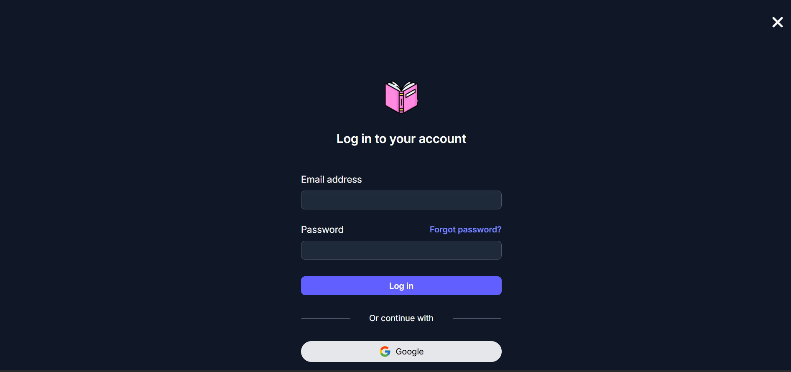
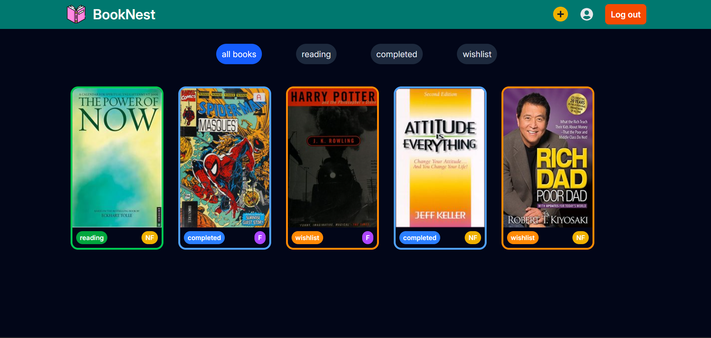

# 📚 BookNest

BookNest is an open-source **CRUD web app** (Create, Read, Update, Delete) where users can manage their books — like a "Book To-Do" application. It is built with **React** and **Tailwind CSS**, uses **Firebase Authentication**, and leverages **Firestore** as a **serverless backend**. "broader and give it in md "
---

## 📸 Screenshots

### Landing Page
 | 

### Authentication Page


### Dashboard


---


## ✨ Features

- ➕ **Add new books**
- 📖 **Read / view book details**
- ✏️ **Update existing books**
- ❌ **Delete books**
- 🔐 **Authentication (Firebase Auth)**
- 🗄️ **Serverless backend (Firestore)**
- 📱 **Responsive design for all devices**
- 🌐 **Landing page, authentication page, dashboard page, modals**

---

## 🛠️ Tech Stack

- ⚛️ **React**
- 🎨 **Tailwind CSS**
- 🛣️ **React Router**
- 🔐 **Firebase Authentication**
- 🗄️ **Firestore Database**
- ⚡ **Vite**


## 📖 What I Learned

Building **BookNest** helped me gain hands-on experience in:

- ⚛️ **React Router** – for routing and navigation between pages  
- 🧩 **useContext** – for global state management  
- 🔐 **Firebase Authentication** – handling login/signup flows securely  
- ☁️ **Firestore** – working with a serverless backend  
- 🎨 **Tailwind CSS** – building responsive and modern UI  
- 📱 **Responsive Design** – designing landing pages, dashboards, and modals  

> 💡 This project taught me how to combine frontend React skills with backend services in a full-featured CRUD app.

---

## 📂 Project Structure

```plaintext
BookNest/
├── .gitignore
├── eslint.config.js
├── index.html
├── node_modules/
├── package-lock.json
├── package.json
├── public/
│   └── vite.svg
├── README.md
├── src/
│   ├── App.jsx
│   ├── assets/
│   │   ├── book-01.png
│   │   ├── book-02.png
│   │   ├── book-03.png
│   │   ├── githubLogo.svg
│   │   ├── googleLogo.svg
│   │   ├── notAvailable.png
│   │   └── react.svg
│   ├── components/
│   │   ├── AuthPage.jsx
│   │   ├── Dashboard.jsx
│   │   ├── DashboardComponents/
│   │   │   ├── BookCard.jsx
│   │   │   ├── BooksContainer.jsx
│   │   │   ├── Header.jsx
│   │   │   ├── Modals/
│   │   │   │   ├── CreateBook.jsx
│   │   │   │   ├── DeleteBook.jsx
│   │   │   │   ├── EditBook.jsx
│   │   │   │   └── FeatureFallBack.jsx
│   │   │   ├── Nav.jsx
│   │   │   └── UserInfoCard.jsx
│   │   ├── Header.jsx
│   │   └── LandingPage.jsx
│   ├── context/
│   │   ├── authContext/
│   │   │   └── index.jsx
│   │   └── React/
│   │       ├── DeleteContext.jsx
│   │       └── EditContext.jsx
│   ├── firebase/
│   │   ├── auth.js
│   │   ├── firebase.js
│   │   └── firebaseConfig.js
│   ├── hooks/
│   │   └── useFirestoreBook.jsx
│   ├── index.css
│   └── main.jsx
├── vite.config.js
```
---

## 🤝 Contributing

BookNest is **open source** 🎉 — anyone is welcome to contribute!  

---